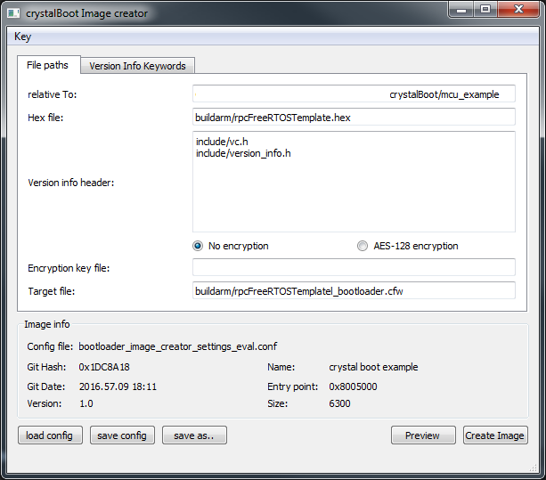
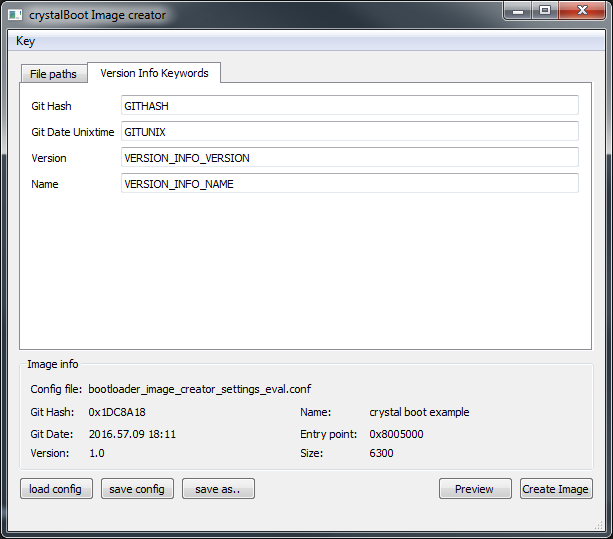
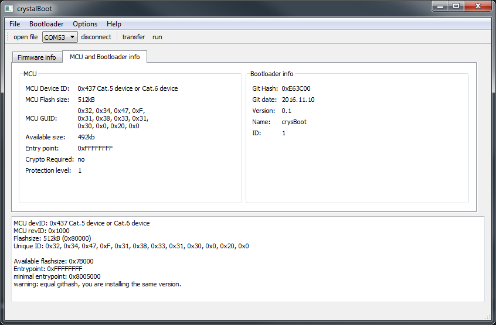

# crystalBoot
a bootloader chain which is portable and uses AES128 as encryption.
Right now it supports the stm32l1xx MCU. 

## Image Creator





The Image Creator creates firmware images which can be uploaded to the MCU using the crystalBoot application.
The Creator accepts as input only hex files since those files define also the addresses and thereby the entry point of the firmware application. The created image includes a variety of meta data like: 
*  git hash of the firmware application. Parsed from source code.
*  git date of the firmware application. Parsed from source code.
*  firmware version. Parsed from source code.
*  firmware name. Parsed from source code.
*  entry point. Taken from input hex file.
*  firmware size. Taken from input hex file.
*  creation date.
*  sha256 checksum which is used to verify the firmware binary inside the flash of the mcu.
*  sha256 checksum which proves the overall consistency of the firmware image.

These data fields are all put in one xml file which forms the firmware image. The binary fields like the checksum or the firmware code itself are base64 encoded.
For getting meta data which describes the firmware, source code parsing is provided. It searches defines with the names specified in the “Version Info Keywords” tab. These defines must be declared in files listed in the “version info header file” list. 

An example:

vc.h: (preferably generated in build process)
```
#define GITHASH 0x1dc8a18 
#define GITDATE "2016-11-09" 
#define GITUNIX 1478714251
```

Version_info.h:
```
#ifndef VERSION_INFO
#define VERSION_INFO


#define VERSION_INFO_VERSION 	"1.0"
#define VERSION_INFO_NAME	"crystal boot example"

#endif
```


### Settings

```
[General]
encryptKeyFileName=
hexFileName=buildarm/rpcFreeRTOSTemplate.hex
targetFileName=buildarm/rpcFreeRTOSTemplatel_bootloader.cfw
keyWord_githash=GITHASH
keyWord_gitdate_unix=GITUNIX
keyWord_version=VERSION_INFO_VERSION
keyWord_name=VERSION_INFO_NAME
encryption=plain

[Version_Info_Header_Files]
file0=include/vc.h
file1=include/version_info.h
```

### Command line arguments
crystalImageCreator.exe PATH_TO_SETTINGS_FILE

## Crystal Boot




